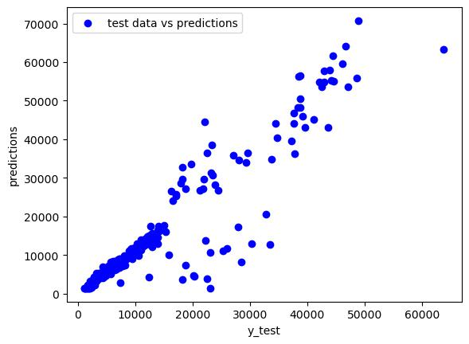

# Medical_Insurance_Pred
Prediction of medical insurance bill using neural network regression model. 
Factors considered are age, sex, bmi, smoker, children, region and finally charges.

- Data source: (https://www.kaggle.com/datasets/mirichoi0218/insurance/code)

# Predictions vs Test Data

  
  

